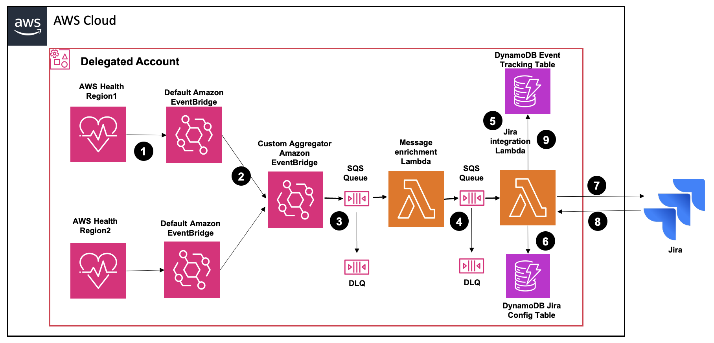

# AWS Health event targeted routing to Jira

**AWS Health event targeted routing to Jira** is a serverless solution that automates the creation and management of Jira tickets from AWS Health planned lifecycle events across an AWS organization. It provides intelligent routing capabilities based on configurable deployment models, ensuring that the right teams receive notifications about infrastructure changes that affect their resources.

This solution significantly reduces operational overhead by automating the creation and management of Jira tickets for AWS infrastructure changes, ensuring teams are notified about relevant events while minimizing alert noise through intelligent ticket updates and routing.


## Key Features

The solution offers several powerful capabilities that streamline operations and enhance incident management:
  1. Automated Lifecycle Event Management: Automatically creates Jira tickets for AWS Health planned lifecycle events, eliminating manual monitoring and ticket creation while ensuring consistent documentation of infrastructure changes.
  2. Event-Driven Architecture: Leverages a serverless, event-driven design that processes events in near real-time with minimal operational overhead automatically scaling to handle event volume fluctuations.
  3. Flexible Routing Models: Supports three configurable deployment models. 
      - Account-based routing directs tickets based on affected AWS accounts
      - Service-based routing organizes tickets by AWS service type (EC2, S3, etc.)
      - Tag-based routing directs tickets based on resource tags, enabling team-specific notifications
  4. Customizable Project Mapping: Allows administrators to define custom mappings between AWS identifiers and Jira projects/issue types, ensuring tickets are created in the appropriate project queues with the correct issue types.
  5. Cross-Organization Visibility: Aggregates health events across all accounts, providing comprehensive visibility through a single deployment.
  6. Resilient Message Processing: Implements dead letter queues with configurable retry policies to handle processing failures, ensuring no events are lost and enabling administrators to troubleshoot problematic events.
  7. Secure Credential Management: Uses AWS Secrets Manager to securely store and manage Jira authentication credentials, eliminating hardcoded secrets and supporting credential rotation without code changes.

## Architecture



The solution consists of the following components:

1. AWS Health Events: Solution supports single account or event aggregation across Organization. Leverages AWS Health's organizational view with delegated account feature to collect health events from all linked accounts

2. AWS EventBridge: The solution leverages a sophisticated EventBridge architecture that combines AWS default EventBridge and a custom EventBridge bus to efficiently aggregate and route AWS Health planned lifecycle events across an organization. The default EventBridge in each region receives AWS Health events directly from the AWS Health service, including events from the organization's delegated administrator account that aggregates health events across all linked accounts. These events are then forwarded to a custom EventBridge bus (HealthEventBus) deployed by the solution in the primary deployment region. This custom bus is configured with a specific rule (HealthEventRule) that filters for AWS Health scheduled change events with event type codes ending in "_PLANNED_LIFECYCLE_EVENT". When matching events are detected, they are routed to the HealthEventIngestionQueue for processing by the Lambda functions. This multi-region event aggregation approach ensures that all AWS Health events from across the organization are centrally processed, regardless of which region or account they originate from, providing a comprehensive and unified view of all planned lifecycle events.

3. AWS Lambda (HealthEventProcessorLambda & HealthEventJiraIntegration): Both Lambda functions work together in a decoupled architecture, with SQS queues providing buffering and resilience. The solution supports appropriate error handling and DLQ implementation for failed message processing.
    - HealthEventProcessorLambda: Processes incoming AWS Health events, categorizes resources, and prepares messages for ticket creation or updates.
    - HealthEventJiraIntegration: Creates and updates Jira tickets based on processed AWS Health events.

4. SQS Queue: The solution implements a robust message processing architecture using Amazon SQS (Simple Queue Service) as a buffer between the Lambda components. This decouples the EventBridge, HealthEventProcessorLambda & HealthEventJiraIntegration Lambda, allowing for better scalability and resilience. The solution also implements a Dead Letter Queue (DLQ) for handling failed message processing. The configuration ensures that messages are retried up to 3 times before being sent to the DLQ, and failed messages are retained for 14 days in the DLQ for troubleshooting.

5. AWS Secrets: The solution creates a dedicated Secrets Manager secret (JiraTokenSecret) that securely stores the Jira user email and API token, eliminating the need to hardcode sensitive credentials in Lambda functions or environment variables.

6. DynamoDB Tables: The solution leverages two specialized DynamoDB tables that serve as the backbone for intelligent event tracking and routing. Both tables use on-demand capacity mode for automatic scaling and are encrypted at rest. The Lambda functions interact with these tables using fine-grained IAM permissions to query routing information and track event-to-ticket relationships.
    
    - Track Table: Maintains the relationship between AWS Health events, affected resources, and their corresponding Jira tickets
    - Jira Project Table: Maps AWS identifiers (account IDs, service names, or resource tags) to specific Jira projects and issue types. Deployment Variants:
      - AccountJiraTable: Maps AWS account IDs to Jira projects
      - ServiceJiraTable: Maps AWS service names to Jira projects
      - TagJiraTable: Maps resource tag values to Jira projects
      - DefaultProjectCode: Includes a special DefaultProjectCode entry that handles unmapped resources

7. IAM Roles and Policies:
    - Lambda execution role
    - Cross-account access added to provided AssumeRoleName (Tag model only)


## Deployment


### Deployment Modes

The solution supports three deployment models:

1. Account: Routes AWS Health events to Jira projects based on the affected AWS account ID. Ideal for organizations with dedicated teams responsible for specific AWS accounts. Ensures account-specific events are automatically directed to the teams responsible for those accounts.

2. Service: Directs events to Jira projects based on the affected AWS service (EC2, S3, RDS, etc.). Simple setup that routes all events for a particular service to the same Jira project Perfect for organizations with specialized teams focused on specific AWS services.  Service-specific teams receive only relevant notifications about their managed services.

3. Tag-Based Routing: Routes events based on resource tags, enabling fine-grained control over ticket assignment. Optimal for organizations using resource tagging for ownership and team attribution. Includes cross-account tag discovery capability using IAM role assumption. Most flexible model that aligns with modern cloud resource tagging practices.

All models include a fallback "DefaultProjectCode" entry that handles any resources not explicitly mapped, ensuring no events are missed. This multi-model approach allows organizations to implement the routing strategy that best aligns with their team structure and operational model.


### Prerequisites
 
1. To aggregate events across Organization, enable [AWS Health organizational view](https://docs.aws.amazon.com/health/latest/ug/enable-organizational-view.html) and [AWS Health delegated account](https://docs.aws.amazon.com/health/latest/ug/delegated-administrator-organizational-view.html). 

2. The solution should be deployed in AWS Health delegated account. We will reference this account as `deployment-account` hereafter.

3. Identify preferred regions for solution deployment. You will configure event forwarding from all other AWS Regions to deployment region for event aggregation.

4. Atlassian JIra account account url, userid and API token

5. S3 bucket for Lambda deployment package

6. IAM Role name to be used for cross account access to linked accounts (Assume Role Name - Only for Tag deployment model)

7. Identify Tag key to monitor (Tag Key to Monitor - Only for Tag deployment model)


### Deployment Instructions

1. Prepare Lambda packages:
   
   ```bash
   zip -r HealthEventProcessorLambda.py.zip HealthEventProcessorLambda.py
   zip -r HealthEventJiraIntegration.py.zip HealthEventJiraIntegration.py
   ```

2. Login to `deployment-account` and switch to the preferred regions for solution deployment

3. Upload Lambda zip files to S3 bucket in your `deployment-account`. Make sure CloudFormation can access this bucket.

4. Deploy CloudFormation template in `deployment-account`:
   1. Open AWS CloudFormation console
   2. Select "Create Stack" → "With new resources (standard)"
   3. Choose "Upload a template file" → "Choose File" → Select provided `cloudformation.yaml`
   4. Click "Next"
   5. Provide the following parameters:
      - **Stack name**: A name for your CloudFormation stack
      - **Deployment Model**: Select deployment model (Account/Service/Tag)
      - **Assume Role Name**: (Required for Tag model only) IAM role name for cross-account tag discovery
      - **Tag Key to Monitor**: (Required for Tag model only) The tag key to monitor for routing events (e.g., 'Environment', 'Application', 'Team') 
      - **JiraBaseUrl**: Your JIRA instance URL (e.g., https://your-domain.atlassian.net)
      - **JiraUserEmail**: JIRA user email address
      - **JiraApiToken**: JIRA API token for authentication
      - **S3BucketName**: S3 bucket containing Lambda deployment packages
      - **HealthEventProcessorKey**: File name of HealthEventProcessor Lambda
      - **JiraIntegrationKey**: File name of HealthEventJiraIntegration Lambda
   6. Click "Next"
   7. Configure stack options as needed
   8. Click "Next"
   9. Review the configuration, select "I acknowledge that AWS CloudFormation might create IAM resources with custom names"
   10. Click "Create stack"

5. Monitor stack creation progress in the CloudFormation console

6. Once complete, note the outputs for resources details

### Configuration

#### Configure HealthEvent aggregation

You need to create rule to send all AWS Health events from default EventBridge bus to the custom EventBridge bus deployed by solution to achieve event aggregation.
  1. In `deployment-account`, goto the region where you deployed the solution and locate the custom EventBridge bus `EventBridgeRuleName` from CloudFormation stack outputs. Note down custom Event bus arn from EventBridge console.
  2. Goto EventBridge console -> Click Event buses from left pane -> Select default Event bus -> Click Create rule
  3. Give Name, ensure rule Enable is selected, choose Rule with an event pattern and click Next
  4. For Event source, select "AWS events or EventBridge partner events"
  5. For Event pattern, select "Use pattern form"
  6. Event source -> select AWS service, AWS Service -> select Health and Event type -> select All events. Click Next.
  7. In Target1 -> select EventBridge event bus -> depending on the region you are configuring select "Event bus in same account and Region" or "Event bus in different account or Region" option
  8. For Event bus target -> from drop-down select the custom event bus name, `EventBridgeRuleName` that you had noted in step a.
  9. Select "Create a new role for the specific resource" in Execution role, click Next
  10. Click Next and then Create rule
  11. Repeat these steps to forward events from all regions to the custom Event bus

#### Configure DynamoDB Mapping

You need to configure the DynamoDB table with mapping information based on chosen deployment model.
  1. Locate the DynamoDB table `DynamoDBTable` from CloudFormation stack outputs
  2. Access the DynamoDB console and select your table
  3. Use the PartiQL editor or item creation interface to add mapping entries
  4. Use "Explore Items" in the DynamoDB console to verify your mappings
  5. Always create a  `DefaultProjectCode` entry to handle unmapped resources

##### Account Model

For the Account deployment model, use below format to create mapping table:

```sql
-- Default mapping (catches all for unmapped accounts)
INSERT into "AccountJiraTable" value {  
    'Account': 'DefaultProjectCode',
    'ACJiraProjectKey': 'JIRAPROJ',
    'ACJiraIssueTypeID': 10001
}

-- Account-specific mapping
INSERT into "AccountJiraTable" value {  
    'Account': '123456789012',
    'ACJiraProjectKey': 'PROD',
    'ACJiraIssueTypeID': 10001
}
```

##### Service Model

Service deployment model mapping example:

```sql
-- Default mapping (catches all for unmapped services)
INSERT into "ServiceJiraTable" value {  
    'Service': 'DefaultProjectCode',
    'SJiraProjectKey': 'JIRAPROJ',
    'SJiraIssueTypeID': 10001
}

-- Service-specific mapping
INSERT into "ServiceJiraTable" value {  
    'Service': 'EC2',
    'SJiraProjectKey': 'INFRA',
    'SJiraIssueTypeID': 10001
}
```

##### Tag Model
Tag deployment model mapping example:


```sql
-- Default mapping (catches all for unmapped tag values)
INSERT into "TagJiraTable" value {  
    'HostTag': 'DefaultProjectCode',
    'HTJiraProjectKey': 'JIRAPROJ',
    'HTJiraIssueTypeID': 10001
}

-- Tag-specific mapping
INSERT into "TagJiraTable" value {  
    'HostTag': 'production-web',
    'HTJiraProjectKey': 'WEB',
    'HTJiraIssueTypeID': 10001
}
```

> **Note**: Replace table names, project keys, and issue type IDs with your actual values. The issue type ID can be found in your JIRA instance by inspecting the issue creation form.

#### Create cross-account IAM role in all linked accounts (Tag deployment model)
You should create a role in every linked account in Tag deployment model for the solution to assume role and pull tagging resources as mentioned in Prerequisites section. The role should trust and allow 'AssumeRole' from role used by 'health-event-processor' Lambda function (HealthEventProcessorRole) in the deployment account to execute list tag operation.
   
Sample role permission policy:
```json
{
    "Version": "2012-10-17",
    "Statement": [
        {
            "Effect": "Allow",
            "Action": [
                "tag:GetResources",
                "tag:GetTagKeys",
                "tag:GetTagValues"
            ],
            "Resource": "*"
        },
        {
            "Effect": "Allow",
            "Action": [
                "s3:GetBucketTagging",
                "iam:ListRoleTags",
                "iam:ListUserTags",
                "route53:ListTagsForResource",
                "autoscaling:DescribeTags"
            ],
            "Resource": "*"
        }
    ]
}
```

Sample role trust policy:

```json
{
  "Version": "2012-10-17",
  "Statement": [
    {
      "Effect": "Allow",
      "Principal": {
        "AWS": "arn:aws:iam::<deployment-account-id>:role/<health-event-processor-lambda-role>"
      },
      "Action": "sts:AssumeRole"
    }
  ]
}
```

By default solution-lambda-role follows cfn_stack_name-JiraIntegrationRole-xxxxxx format.

### Testing the Solution

To verify your deployment is working correctly:

  1. **Simulate a Health Event**:
    - You can use AWS Health API to create test events in your development environment
    - Alternatively, wait for a real AWS scheduled maintenance event

  2. **Monitor Lambda Execution**:
    - Check CloudWatch Logs for the Lambda function
    - Verify the function is processing events correctly

  3. **Verify JIRA Ticket Creation**:
    - Log into your JIRA instance
    - Confirm tickets are being created with the correct information
    - Check that the ticket contains relevant AWS Health event details


## Troubleshooting

Common issues and solutions:

  1. **Lambda Function Errors**:
    - Check CloudWatch Logs for error messages
    - Verify IAM permissions are correctly configured
    - Ensure JIRA credentials are valid

  2. **Missing JIRA Tickets**:
    - Verify DynamoDB mapping entries are correct
    - Check SQS queues for stuck messages
    - Confirm EventBridge rule is properly configured

  3. **Cross-Account Tag Discovery Issues**:
    - Verify IAM roles are correctly set up in all accounts
    - Check trust relationships between accounts
    - Ensure tag permissions are properly configured

## Security

- JIRA credentials are stored securely in AWS Secrets Manager
- IAM roles follow least privilege principle
- Consider implementing VPC endpoints for enhanced security
- Regularly rotate JIRA API tokens

See [CONTRIBUTING](CONTRIBUTING.md#security-issue-notifications) for more information.

## License

This library is licensed under the MIT-0 License. See the LICENSE file.

